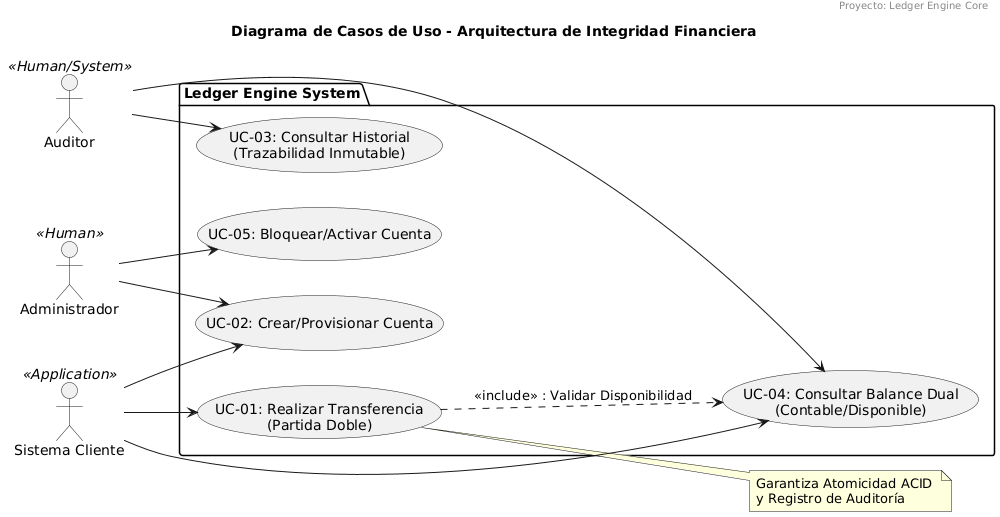

# 03 – Análisis de Casos de Uso

## 3.1 Propósito del Documento

Este documento describe los **casos de uso funcionales** del sistema **Ledger Engine Core**, detallando
los actores, responsabilidades y flujos de interacción que garantizan **integridad financiera, atomicidad
transaccional y trazabilidad inmutable**.

El objetivo es establecer un contrato claro entre el dominio contable y los sistemas consumidores,
sirviendo como referencia para:
- Diseño de APIs
- Implementación de reglas de negocio
- Auditoría técnica y compliance
- Evolución controlada del sistema

---

## 3.2 Alcance del Sistema

El sistema se delimita explícitamente como **Ledger Engine Core**.

### En Alcance
- Gestión de cuentas contables internas
- Ejecución de transferencias por partida doble
- Registro inmutable de Journal Entries
- Cálculo y exposición de balances (contable y disponible)
- Auditoría y trazabilidad completa

### Fuera de Alcance
- Interfaces de usuario (UI / Frontend)
- Conversión de monedas
- Integraciones bancarias externas
- Orquestación de procesos de negocio de alto nivel

El motor actúa como un **core financiero transaccional**, no como un sistema de presentación.

---

## 3.3 Diagrama de Casos de Uso (UML)

El siguiente diagrama representa los casos de uso principales del sistema y sus actores:

**Actores**
- **Sistema Cliente («Application»)**: Consume el motor vía API REST o mensajería.
- **Administrador («Human»)**: Gestiona el ciclo de vida de las cuentas.
- **Auditor («Human/System»)**: Consulta la trazabilidad inmutable para fines regulatorios.

**Casos de Uso**
- UC-01: Crear / Provisionar Cuenta
- UC-02: Realizar Transferencia (Partida Doble)
- UC-03: Consultar Historial (Trazabilidad Inmutable)
- UC-04: Consultar Balance Dual (Contable / Disponible)
- UC-05: Bloquear / Activar Cuenta

> Nota técnica:  
> El caso de uso **UC-01 incluye explícitamente la validación de disponibilidad**, reforzando la
> necesidad de consistencia ACID y control de concurrencia.

---

## 3.4 Especificación del Caso de Uso Principal – UC-01

### Identificación
| Atributo | Detalle |
|--------|--------|
| **Nombre** | Realizar Transferencia entre Cuentas |
| **Tipo** | Caso de uso transaccional crítico |
| **Actor Principal** | Sistema Cliente |
| **Objetivo** | Ejecutar una transferencia atómica garantizando partida doble e inmutabilidad |

---

### A. Precondiciones (Reglas de Negocio del Dominio)

1. **Existencia**  
   Ambas cuentas deben existir dentro del dominio contable.

2. **Moneda**  
   La moneda de la transferencia debe coincidir con la moneda de ambas cuentas.  
   _No se permite conversión implícita._

3. **Estado de la Cuenta Origen**  
   La cuenta de débito debe estar en estado `ACTIVE`.

4. **Capacidad de la Cuenta Destino**  
   La cuenta de crédito debe estar habilitada para recibir fondos (no bloqueada / no embargada).

5. **Monto**  
   El monto debe ser estrictamente mayor a `0.0000`, con precisión fija de 4 decimales.

6. **Disponibilidad**  
   El **Saldo Disponible** de la cuenta origen debe ser mayor o igual al monto solicitado.

---

### B. Flujo Básico (Camino Feliz)

1. **Recepción de Solicitud**  
   El Sistema Cliente envía:
    - `accountIdOrigen`
    - `accountIdDestino`
    - `monto`
    - `moneda`
    - `motivo`
    - `correlationId`

2. **Validación de Dominio**  
   El motor valida todas las precondiciones definidas.

3. **Inicio de Transacción**  
   Se abre un contexto transaccional ACID en PostgreSQL.

4. **Registro Contable (Partida Doble)**
    - Se genera un **Journal Entry DEBIT** para la cuenta origen.
    - Se genera un **Journal Entry CREDIT** para la cuenta destino.
    - Ambos asientos comparten un **TransactionID único**.

5. **Actualización de Snapshots**  
   Se actualizan los balances de las cuentas utilizando **Optimistic Locking**.

6. **Auditoría y Compliance**  
   Se registra el evento en el **Audit Log**, incluyendo metadatos del sistema solicitante.

7. **Persistencia**  
   Se realiza el `COMMIT` de la transacción.

8. **Respuesta**  
   El sistema devuelve el `TransactionID` y los saldos resultantes.

---

### C. Flujos Alternativos (Excepciones)

- **A1 – Saldo Insuficiente**  
  Se lanza `InsufficientFundsException`.  
  La transacción se revierte completamente (`ROLLBACK`).

- **A2 – Error de Concurrencia**  
  Si ocurre una colisión por actualización concurrente:
    - Se captura la excepción de Optimistic Locking.
    - Se revierte la transacción.
    - Se solicita reintento al cliente.

- **A3 – Idempotencia**  
  Si el `correlationId` ya existe:
    - No se reprocesa la operación.
    - Se devuelve la respuesta original.

---

## 3.5 Historias de Usuario (Backlog Inicial)

Estas historias representan unidades de valor funcional que alimentan el tablero Scrum.

### US-01 – Provisión de Cuentas Internas
**Como** Sistema Cliente  
**Quiero** crear cuentas internas con moneda y estado definidos  
**Para** habilitar operaciones en el ledger

**Criterios de Aceptación**
- Identificadores UUID v4
- Validación estricta de moneda ISO 4217
- Persistencia inicial en estado `ACTIVE`

---

### US-02 – Ejecución Transaccional Consistente
**Como** Sistema Cliente  
**Quiero** ejecutar transferencias atómicas por partida doble  
**Para** garantizar consistencia financiera

**Criterios de Aceptación**
- Integridad total: ambos asientos o ninguno
- Saldos actualizados solo tras validación exitosa
- Rechazo de montos nulos o negativos

---

### US-03 – Consulta de Trazabilidad e Integridad
**Como** Auditor  
**Quiero** consultar el historial inmutable de movimientos  
**Para** verificar cumplimiento regulatorio

**Criterios de Aceptación**
- Listado cronológico de Journal Entries
- Imposibilidad física de edición o borrado
- Acceso de solo lectura

---

## 3.6 Evaluación del Diagrama de Casos de Uso

El diagrama refleja con precisión el rigor técnico del sistema:

- **Boundary del Sistema** claramente definido
- Uso correcto de la relación `<<include>>` para validaciones críticas
- Actores estereotipados que diferencian consumo humano y sistémico
- Nota explícita sobre **atomicidad ACID y auditoría**, justificando el uso de transacciones y logging inmutable

Este documento confirma que **Ledger Engine Core no es un CRUD**, sino un motor contable con reglas
de integridad de nivel financiero.
