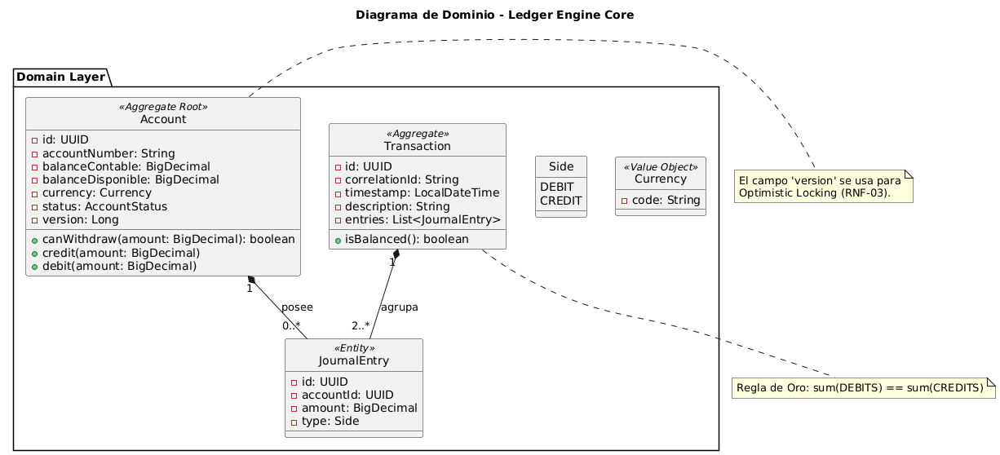

# 05 – Modelo de Dominio
## 5.1 Modelo de Dominio

El siguiente diagrama representa el **modelo de dominio contable** y sus responsabilidades:

### Responsabilidades Clave

* **Account (Aggregate Root)**

    * Protege invariantes de saldo
    * Controla retiros y créditos
    * Gestiona concurrencia mediante `version` (Optimistic Locking)

* **Transaction (Aggregate)**

    * Representa una unidad lógica y atómica de movimiento
    * Garantiza la regla de oro: `sum(DEBITS) == sum(CREDITS)`

* **JournalEntry (Entity)**

    * Registro contable inmutable
    * Representa eventos económicos, no estados

* **Currency (Value Object)**

    * Garantiza consistencia monetaria
    * Evita operaciones entre monedas incompatibles

---

## 5.2 Persistencia: Ledger + Snapshots (Modelo Híbrido)

El sistema implementa un **modelo híbrido inspirado en Event Sourcing**, pero sin adoptar su complejidad total.

### Fuente de Verdad

* El **Journal (JournalEntry)** es la **fuente de verdad inmutable**
* Persistencia **append-only**
* No se permite UPDATE ni DELETE

Esto garantiza:

* Trazabilidad completa
* Auditoría confiable
* Capacidad de reconstrucción histórica

---

## 5.3 Snapshots de Balance

Aunque el ledger es la fuente de verdad, **calcular balances recorriendo todo el historial es inviable** a escala.

Por ello:

* `Account.balanceContableSnapshot`
* `Account.balanceDisponibleSnapshot`

actúan como **proyecciones materializadas** del ledger.

### Ventajas

* Lecturas O(1)
* Consultas de balance en tiempo real
* Escalabilidad operativa

### Riesgos

* Posible desincronización lógica

### Mitigación

* Actualización de snapshots **dentro de la misma transacción ACID**
* Reconciliables contra el ledger en cualquier momento

---

## 5.4 Trade-offs (Decisiones Conscientes)

Este diseño **no es dogmático**. Es deliberado.

### Decisiones Tomadas

* Se prioriza **consistencia e integridad financiera** sobre latencia extrema
* Se acepta mayor complejidad transaccional a cambio de auditabilidad
* Se evita Event Sourcing puro para reducir costo cognitivo y operativo

### Justificación

En sistemas financieros:

* Un error de centavos es inaceptable
* La trazabilidad es obligatoria
* La corrección es más valiosa que la velocidad marginal

Este enfoque refleja **trade-offs reales de sistemas de misión crítica**, no patrones aplicados por moda.

---

## 5.5 Escalabilidad Futura

El diseño habilita evoluciones sin reescritura:

* Separación CQRS (lecturas en réplicas)
* Proyecciones asincrónicas
* Exposición de eventos del ledger
* Integración con sistemas antifraude o regulatorios

La arquitectura está pensada para **crecer sin comprometer el núcleo contable**.
