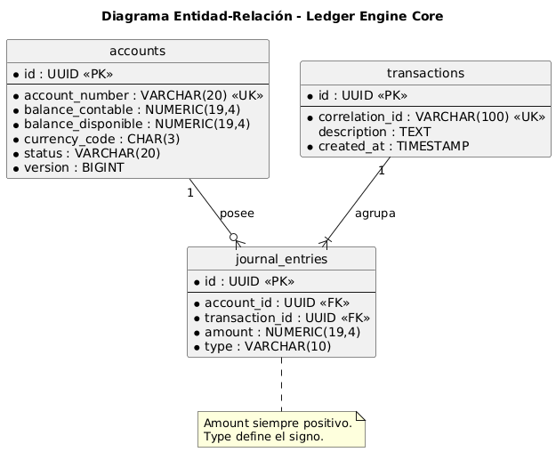

# 06 – Diseño de Base de Datos

Este documento describe el diseño físico de la base de datos de **Ledger Engine Core**, las decisiones de normalización y las restricciones técnicas que garantizan la integridad de los datos financieros.

---

## 6.1 Diagrama Entidad-Relación (Físico)

En este nivel técnico, el sistema se aleja de las clases de dominio para centrarse en tablas, tipos de datos e índices que aseguran la persistencia ACID en PostgreSQL.

El siguiente diagrama representa el **modelo físico de datos** y las relaciones persistidas del ledger.

---

## 6.2 Análisis de Integridad y Normalización

### Auditoría de Normalización
1. **Primera Forma Normal (1NF):** Cada columna contiene valores atómicos y no existen grupos repetidos. Cada tabla posee una Clave Primaria (UUID) inequívoca.
2. **Segunda Forma Normal (2NF):** Todos los atributos no clave dependen totalmente de su clave primaria. Se han separado las cuentas de las transacciones para evitar redundancias.
3. **Tercera Forma Normal (3NF):** No existen dependencias transitivas. Al utilizar el código ISO 4217, se evita la dependencia de datos no clave como nombres de moneda.

### Consideración Técnica: Desnormalización Controlada
Se mantiene el balance en la tabla `accounts` (`balance_contable` y `balance_disponible`) como una decisión de ingeniería por **performance**. Aunque técnicamente es un estado derivado del ledger, actúa como un **Snapshot** para permitir lecturas $O(1)$ sin comprometer la integridad gracias al uso de **Optimistic Locking** y transacciones **ACID**.

---

## 6.3 Restricciones de Dominio
* **Índice de Idempotencia:** El `correlation_id` impide el doble procesamiento de una misma solicitud técnica.
* **Referencialidad:** Las `journal_entries` están vinculadas de forma estricta a una `transaction_id`, impidiendo la eliminación de registros y manteniendo la inmutabilidad (RF-04).
* **Precisión Financiera:** El uso de `NUMERIC(19,4)` evita los errores de redondeo de tipos `FLOAT` o `DOUBLE`.